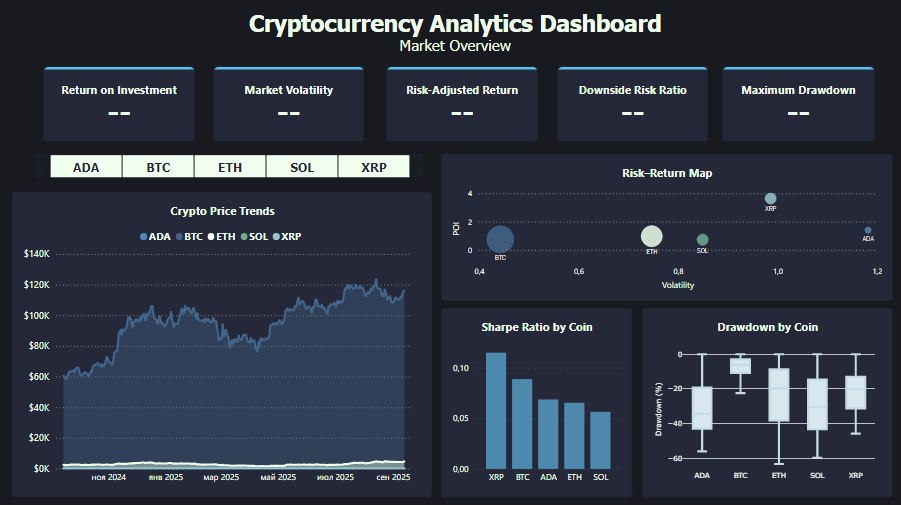

# Cryptocurrency Analytics Dashboards  

This project contains two complementary dashboards:  
1. **Market Overview Dashboard** – a comprehensive overview of the cryptocurrency market.  
2. **Strategy Simulation Dashboard** – a tool for modeling investment strategies.  

Together, they form an integrated analytics system: from **evaluating risks and returns** to **testing strategy effectiveness in real-world scenarios**.  

---

## 1. Market Overview Dashboard  

### Purpose  
Provide a broad market view, assess the stability of assets, their risk exposure, and profitability potential.  

  

### KPI  
- **ROI % (Return on Investment)** – average return.  
- **Market Volatility %** – volatility level of assets.  
- **Risk-Adjusted Return** – profitability adjusted for risk.  
- **Downside Risk Ratio** – frequency of loss-making periods.  
- **Maximum Drawdown %** – maximum observed decline.  

> ⚠️ KPI are displayed **only when a single coin is selected** (ADA, BTC, ETH, SOL, XRP) to avoid confusion from aggregated values.  

  

### KPI Color Logic  
Conditional formatting is applied for fast interpretation:  
- 🟢 **Green** – positive performance (ROI > 0, Sharpe/Sortino > 0, Drawdown below average risk).  
- 🔴 **Red** – negative performance (ROI < 0, high risk, or severe drawdown).  
- 🟡 **Yellow** – neutral range (close to 0 or borderline acceptable).  

This allows users to quickly assess asset status at a glance:  
- green = promising asset,  
- red = risk warning,  
- yellow = requires further review.  

### Visualizations  
- **Crypto Price Trends (Line Chart)** – price dynamics over time.  
- **Risk–Return Map (Bubble Chart)** – risk vs. return positioning of assets.  
- **Sharpe Ratio by Coin (Bar Chart)** – investment efficiency.  
- **Drawdown by Coin (Boxplot)** – distribution of maximum drawdowns.  

---

## 2. Strategy Simulation Dashboard  

### Purpose  
Enable investors to model outcomes of three approaches:  
- **Buy & Hold**  
- **Buy the Dip**  
- **Dollar-Cost Averaging (DCA)**  

### KPI  
- **Invested Amount (USD)** – initial investment amount (controlled by slider).  
- **Final Portfolio Value (USD)** – ending portfolio value.  
- **Profit (USD)** – net result in USD.  
- **ROI %** – return on investment in percent.  

> ⚠️ KPI are also displayed only when a **single coin** is selected.  

### Visualizations  
- **Final Value by Coin & Strategy (Clustered Bar Chart)** – portfolio outcome per strategy.  
- **ROI Distribution by Strategy (Boxplot)** – distribution of ROI across strategies.  
- **Coin Cards (ADA, BTC, ETH, SOL, XRP)** – individual cards with Final Value, Profit, and ROI %.  

---

## Dashboards Interaction  

- **Market Overview Dashboard** answers:  
  - Which coins are more stable?  
  - Which assets provide the best risk–return trade-off?  
  - How did prices evolve over time?  

- **Strategy Simulation Dashboard** answers:  
  - Which strategy works best for a given coin?  
  - How does profitability change with different investment amounts?  
  - Which asset delivers the most favorable outcome under chosen conditions?  

 Together, the dashboards deliver a **holistic decision-support system**:  
from **market diagnostics** → to **strategy testing**.  
